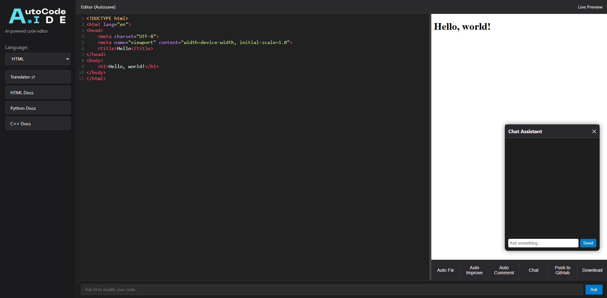

# 🚀 AUTOCODE.IDE

AUTOCODE.IDE is a smart AI-powered web-based IDE designed to make coding and AI creation accessible to everyone. It supports real-time previews, intelligent code suggestions, neural network building, and much more—all right in your browser.

---

## 📱 Overview

AUTOCODE.IDE was born from the idea that while coding is a vital 21st-century skill, it’s still out of reach for most people. With this platform, anyone—regardless of experience—can explore programming and AI without needing to master complex tools or environments.

Inspired by early experiences with tools like Trinket, AUTOCODE.IDE eliminates the friction of setting up environments and debugging inconsistencies. It’s fast, AI-enhanced, and fully browser-based.

---

## 🌐 Access the Live Demo

🚀 Try out the IDE live:

🔗 [Live AUTOCODE.IDE Demo](https://genuine-strudel-dc4dc3.netlify.app)

---

## 🚀 Features

- 🤖 **AI Code Assistant**  
  Write, fix, and debug code with the help of OpenAI's powerful models.

- 🧠 **Neural Network Builder**  
  Visually construct and experiment with simple neural networks directly in the browser.

- 💻 **Real-Time Preview IDE**  
  Instantly see the results of HTML, CSS, JS, and Python code as you type.

- 🔄 **Code Translator**  
  Convert code between Python, JavaScript, and C++ to learn and understand differences.

- 🗂️ **Project Workspace**  
  Organize and manage code projects, with plans to support GitHub integration.

- 🪄 **Smart Error Explanation**  
  Errors are caught and explained by AI, helping users learn while they code.

---

## ⚒️ How We Built It

Our journey started in grade 8 and 9 when we were first introduced to HTML, JavaScript, and Python using Trinket. We faced frustrating limitations, including runtime errors and inconsistent previews. That led to the idea behind AUTOCODE.IDE: a tool that empowers users to code confidently, learn faster, and explore AI without friction.

We built it with love, using modern web tech and a focus on frontend innovation:

- 🔹 No backend required for code execution (runs in-browser via Pyodide).
- 🔹 Uses OpenAI’s API for code suggestions and error explanations.
- 🔹 Designed for both beginners and advanced users.

---

## 🧠 AI Integration

- **OpenAI API** – Handles code completion, translation, and error explanations in natural language.

---

## 🔧 Tech Stack

- **Frontend:** HTML, CSS, JavaScript
- **Editor:** CodeMirror
- **AI:** OpenAI API (ChatGPT)
- **Python Engine:** Pyodide
- **Deployment:** Netlify

---

## 🔥 Challenges We Faced

- ⏳ Finding the right project idea took time—we spent the first 40 minutes just brainstorming.
- 💡 Creating a real-time code environment without a backend pushed us to our limits.
- 📦 State management and frontend optimization were key to achieving responsiveness and stability.
- 🌐 Making neural networks understandable for beginners while keeping the UI clean.
- 💻 Broken 

---

## 🎓 What We Learned

Participating in Garuda Hacks 6.0 was our **first offline hackathon**. It taught us valuable lessons in:

- 👥 Teamwork and Collaboration  
- ⏰ Time Management under Pressure  
- 💻 Full-stack Web Development  
- 🤝 Communicating Ideas and Turning Them into Action  

---

## 🔮 What's Next for AUTOCODE.IDE

- 📁 **Multi-File Support**  
  Ability to create and manage multiple files within a project.

- 🧠 **Advanced Neural Network Tooling**  
  Add layer customization, training visualization, and export options.

- ☁️ **Cloud Save and GitHub Integration**  
  Seamlessly sync work and share code across platforms.

- ⚙️ **Better Language Support**  
  Add more languages and custom runtime environments.

---

## 👨‍💻 Developers

- **Owen** — Fullstack Developer
- **Dave** — UI/UX Designer
- **Leo** — Fullstack Debugger
- **Declan** — Ai-Asissted Programmer  

---

## 🔧 License

This project is licensed under the **MIT License**.

---

> Made with ❤️ at Garuda Hacks 6.0

